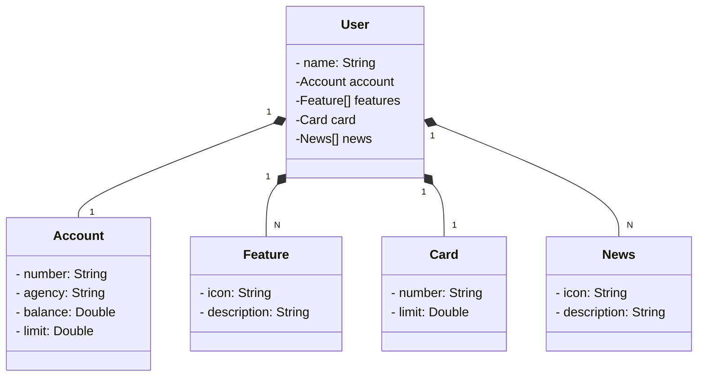

# Spring project Dio Santander Week 2023

Projeto desenvolvido para colocar em prática habilidades em projeto em Linguagem Java com Springboot.
A seguir vamos poder ver o diagrama de classes feito com recurso grafico mermaid e ChatGPT, onde informamos as classes em formato json para a IA criar o diagrama em formato Mermaid. Mais informações em: https://mermaid.js.org/

## Diagrama de classes:


## Desenvolvimento em etapas
Para melhor entender a evolução desse projeto você pode comparar as diferentes branchs aqui nesse repositório
1. model - [link](https://github.com/jacquelinesantana/spring-project-dio-santander/tree/model)
2. models-melhoradas - [link](https://github.com/jacquelinesantana/spring-project-dio-santander/tree/models-melhoradas)
3. repository - [link](https://github.com/jacquelinesantana/spring-project-dio-santander/tree/repository)
4. configuracao-com-yml - [link](https://github.com/jacquelinesantana/spring-project-dio-santander/edit/configuracao-com-yml/)
5. service - [link](https://github.com/jacquelinesantana/spring-project-dio-santander/tree/service)
6. controller - [link](https://github.com/jacquelinesantana/spring-project-dio-santander/tree/controller)

## Configurações para conectar com o H2
Para esse projeto em localhost vamos utilizar o banco de dados em memória H2
Para isso criamos um arquivo YML chamado application-dev.yml com a seguinte estrutura de código:

```
server:
  port: 9090
spring:
  datasource:
    url: jdbc:h2:mem:sdw123
    username: sa
    password: sa
  jpa:
    show-sql: true
    open-in-view: false
    hibernate:
      ddl-auto: create # validate | update | create | create-drop
    properties:
      hibernate:
        format_sql: true
  h2:
    console:
      enabled: true
      path: /h2-console
      settings:
        trace: false
        web-allow-others: false

```

Após implementar o código acima vamos configurar o run configuration para trabalhar com esse application, também excluídos a estrutura anterior de application.
1. menu **run**
2. opção **run configuration**
3. guia **Environment**
4. botão **add**
5. na caixa de new environment variable vamos inserir em nome: SPRING_PROFILES_ACTIVE no value: dev
6. aplicar e executar o projeto

## Deploy

A etapa de deploy é quando vamos hospedar a aplicação em nuvem e vamos utilizar para isso o serviço: https://railway.app

Esse serviço é pago, no entanto ao cadastrar você terá direito a um crédito de 5 dólares o que já é suficiente para hospedarmos um projeto.

1. clique na opção de login com o github
2. escolha no botão new project 
3. opção provision PostgreSQL
4. o seu banco de dados já estará pronto e na guia váriaveis de ambiente vc pode confirmar os dados para conectar seu api ao banco de dados que acabou de criar.

### Conexão com banco de dados

Primeiro passo será criar as configurações que vai nos permitir conectar com um banco de dados em produção, para isso teremos algumas ações e a primeira será configurar um novo arquivo no resource, depois vamos configurar as variáveis de ambiente também.

Arquivo novo no resource, o nome desse novo arquivo será application-prod.yml

Conteúdo do arquivo:

```
spring:
  datasource:
    url: jdbc:postgresql://${PGHOST}:${PGPORT}/${PGDATABASE}
    username: ${PGUSER}
    password: ${PGPASSWORD}
  jpa:
    open-in-view: false
    hibernate:
      ddl-auto: create
```

OBS: lembre-se que a formatação desse arquivo deve ser respeitada para evitar conflitos/erros não esperados.

OBS2: note que o arquivo tem nome de várias variáveis tais como PGHOST, PGPORT essas variáveis devem ter seus valores passados, vamos ver isso nesse próximo passo:

1. vá até o menu Run, opção run configurations
2. aqui vamos duplicar a opção do projeto que fizemos o run para a configuração dev agora para o prod:

3. adicione as variáveis de ambiente clicando na guia Environment botão add. não esqueça de remover a variável já existente da configuração de conexão local com h2.
4. o resultado esperado é conforme o print a seguir:
5. para a informação SPRING_PROFILES_ACTIVE o valor será: **prod**
6. todos os valores das demais variáveis devem ser preenchidas conforme os dados do seu banco de dados:


Perfeito, feito isso já se pode **executar o projeto** e **ver o banco de dados ser formado no host da Railway,** clique na guia Data:

